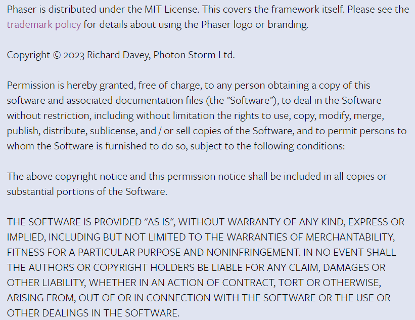

# Welcome to "Web Game Development" tutorial
In this tutorial, you can make web game like this -> [link](http://copomos00.ajousw.kr/phaser3/)  
If you learn how to make web game, watch this vidio -> [link]()
# 오픈소스에서 Documents를 읽는 것은 중요하다
Documents를 읽는 것은 당연한 것이지만, 대부분 인터넷에서 잘 정리된 글을 찾아 읽는다. 하지만 phaser3와 같은 비교적 덜 유명하다 할 수 있는 오픈소스는 특히 Documents를 읽는 것이 중요하다. 하지만 Documents의 대부분은 길고 어렵기에 훈련되지 않는 사람은 읽고 해석하는 것 자체로 스트레스를 받을 수 있다. 본 Tutorial은 phaser3를 처음 사용하는 사람의 입장에서 Documents를 어떻게 사용해야 하는지를 알려준다.
# 동기
웹 게임의 접근성은 주목할 가치가 있습니다. 언제, 어디서든 인터넷만 연결되 있다면 어떤 사전 작업도 필요없이 접근 가능합니다. 이러한 접근성은 포토플리오, 프로토타입, 프레임워크, 비쥬얼 스토리보드 등의 다양한 활용이 가능합니다. 게임은 기술의 집약체이며, 어떤 컨텐츠든 표현 가능하기에 그렇습니다.  
심지어 어렵지 않습니다. Web Page는 GitHub, GitLab을 이용하면 되며 Web Game의 경우 개발에 도움이 되는 오픈소스가 많습니다.  
때문에 이 주제를 선정했습니다. 오픈소스로 Web Game을 만들고, 그 접근성을 살려 특별한 자기소개서를 만들어보려 합니다.
# 역경
오픈소스는 으래 그렇듯 그 내용을 파악하는 과정이 친절하지 않습니다. Documents를 꼼꼼히 살펴보며 특성과 기능을 배워야하며, 이슈가 잘 생깁니다.   
Web Pages를 만드는 과정에서 GitLab, GitHub의 관련 기능들을 공부해야 했습니다. 제 수준에선 이해하기 힘든 낯선 구동 파이프라인을 가지고 있어서 난감했습니다. 특히 GitLab의 경우는 정말 새로운 문물을 접하는 기분이 들었습니다.  
Phaser3의 경우 웹 보안 이슈가 제 골치를 아프게 했습니다. 디버깅을 위해 Local Test를 진행했었는데, Local에서 Image를 가져오지 못 하던 것이 보안 때문일 거란 생각을 못해서 한참을 해맸었습니다. Image를 GitLab Repository에 넣어 그걸 불러옴으로써 해당 이슈는 해결했습니다.
# 후기
반갑습니다. 길었던 한 학기가 끝나고 다시 한 번 프로젝트로 끝을 장식하네요. 늘 재밌는 강의 감사드린다는 말씀 꼭 드리고 싶었고요, 교수님의 진실된 가르침은 언제나 학업을 넘어 인생의 교훈을 깨우치는 이정표가 됐습니다. 이환용 교수님 존경하고 감사합니다!
# GitHub/GitLab이 pages를 만드는 과정
To use GitLab Pages, you must create a project in GitLab to upload your website’s files to. These projects can be either public, internal, or private.

GitLab always deploys your website from a specific folder called public in your repository. When you create a new project in GitLab, a repository becomes available automatically.

To deploy your site, GitLab uses its built-in tool called GitLab CI/CD to build your site and publish it to the GitLab Pages server. The sequence of scripts that GitLab CI/CD runs to accomplish this task is created from a file named .gitlab-ci.yml, which you can create and modify. A specific job called pages in the configuration file makes GitLab aware that you’re deploying a GitLab Pages website.

You can either use the GitLab default domain for GitLab Pages websites, *.gitlab.io, or your own domain (example.com). In that case, you must be an administrator in your domain’s registrar (or control panel) to set it up with Pages.

The following diagrams show the workflows you might follow to get started with Pages.

# GitHub/GitLab pages의 유지보수, live server

phaser3와 github, gitlab의 copylight
# Phaser3는 MIT License를 선언한 오픈소스입니다
